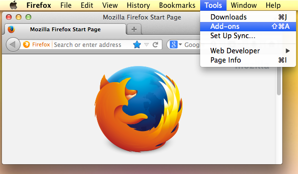
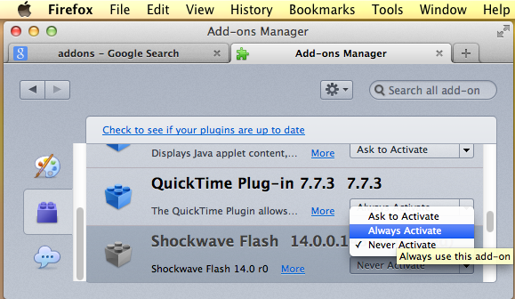

### Checklist

#### MacOSX environment
* Check the extension of your cable power is not out of reach to the place of the webinar/streaming
* Check your batteries of your notebook/netbook is charged to full extent
* Verify that your Mozilla Firefox® is [updated](https://support.mozilla.org/en-US/kb/update-firefox-latest-release)
* [Clear the caché](https://support.mozilla.org/en-US/kb/how-clear-firefox-cache) of your Mozilla Firefox®
* ~~Verify that your Adobe Flash Player® is [updated](https://helpx.adobe.com/flash-player/kb/flash-player-background-updates.html)~~
* ~~Verify that your Adobe Flash Player® is enabled~~
    * ~~Run Mozilla Firefox®.~~
    * ~~Choose `Firefox` > `Tools` > `Add-ons`.~~
      
    
    * ~~Select `Plugins`~~
    * ~~In the list of Add-ons, look for `Shockwave Flash` (another name for `Flash Player`) and check the _status_ that appears to the right of the plug-in name.~~
      
    
    * ~~Select `Always Activate`~~
    * ~~Close the dialog box~~
    * ~~Restart your Mozilla Firefox®~~
* Verify that your Google Chrome® is [updated](https://support.google.com/chrome/answer/95414?co=GENIE.Platform%3DDesktop&hl=en)
* [Clear the cache](https://support.google.com/accounts/answer/32050?co=GENIE.Platform%3DDesktop&hl=en) of your Google Chrome®

#### Windows environment
* Check the extension of your cable power is not out of reach to the place of the webinar/streaming
* Check your batteries of your notebook/netbook is charged to full extent
* Verify that your Mozilla Firefox® is [updated](https://helpx.adobe.com/flash-player/kb/flash-player-background-updates.html)
* Clear the [caché](https://support.mozilla.org/en-US/kb/how-clear-firefox-cache) of your Mozilla Firefox®
* ~~Verify that your Adobe Flash Player® is [updated](https://helpx.adobe.com/flash-player/kb/flash-player-background-updates.html)~~
* ~~Verify that your Adobe Flash Player® is enabled~~
    * ~~Run Mozilla Firefox®.~~
    * ~~Choose `Firefox` > `Tools` > `Add-ons`.~~ 
      
    
    * ~~Select `Plugins`.~~
    * ~~In the list of Add-ons, look for `Shockwave Flash` (another name for `Flash Player`) and check the _status_ that appears to the right of the plug-in name.~~
      
    
    * ~~Select `Always Activate`.~~
    * ~~Close the dialog box.~~
    * ~~Restart your Mozilla Firefox®.~~
* Verify that your Google Chrome® is [updated](https://support.google.com/chrome/answer/95414?co=GENIE.Platform%3DDesktop&hl=en)
* [Clear the cache](https://support.google.com/accounts/answer/32050?co=GENIE.Platform%3DDesktop&hl=en) of your Google Chrome®

#### Linux environment
* System requeriments:
    - 2.33GHz or faster x86-compatible processor, or Intel Atom 1.6GHz or faster processor for netbooks.
    - Latest versions of Mozilla Firefox.
    - 512MB of RAM; 128MB of graphics memory.
* Tested on: Lubuntu 16.04.3 (64 bits)
* ~~Linux is not supporting Adobe Flash Player® in its store anymore. Therefore you have to install it manually.~~
* ~~Open this link: `http://get.adobe.com/flashplayer/`. It will automatically suggest you a version according to your operating system ecosystem.~~
* ~~Select `.tar.gz for Linux` option.~~
* ~~Now click on `Download` button. _Tip:_ select the downloading path (the default `Downloads` folder) for easy access.~~
* ~~Now select the downloaded file, right click on it and select `Extract Here` option.~~
* ~~Open Terminal (`CTRL+ALT+T`) and write the following commands one by one:~~
* ~~`cd ../` then press `Enter` key.~~
* ~~`cd name-of-your-pc` then press `Enter` key.~~
* ~~`cd Downloads` (this is the folder where you have downloaded the `.tar.gz`) then press `Enter` key.~~
* ~~`cd flash_player_npapi_linux.x86_64` (Your file name may be different, just copy the name of file and paste it in Terminal)~~
* ~~`sudo mv libflashplayer.so \/usr/lib/firefox-addons/plugins` then press `Enter` key.~~
* ~~Now close your Mozilla Firefox® and Terminal.~~
* ~~Open Mozilla Firefox®.~~
* ~~Visit this link: `http://get.adobe.com/flashplayer/about/`: it will show you your Adobe Flash Player®'s version and suitable installation.~~

### Legal
All other trademarks are the property of their respective owners.
Windows is a registered trademark of Microsoft Corporation in the United States and/or other countries.
Lubuntu is a trademark of Canonical.
