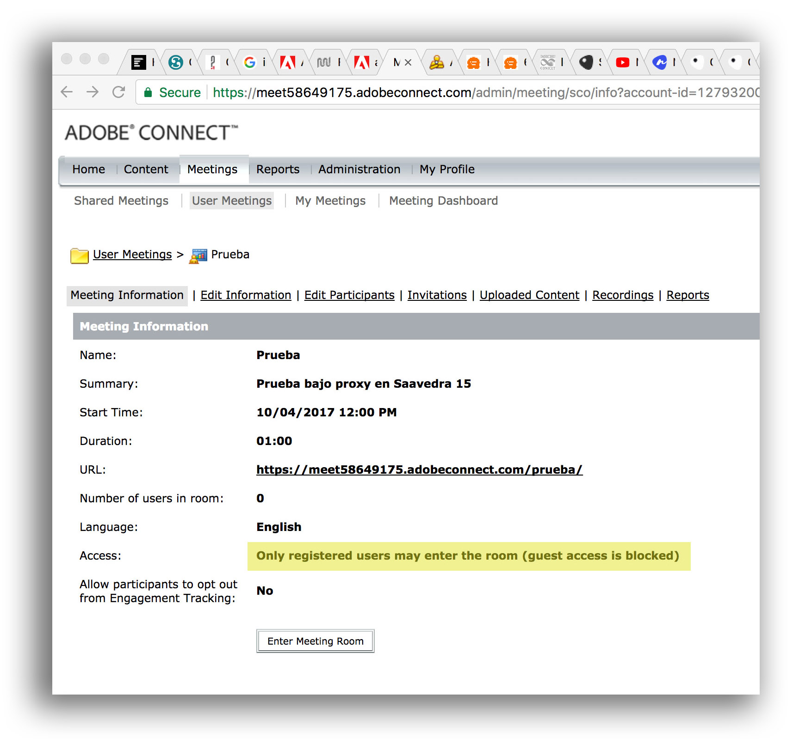

# RATIONALE #

* A guide of _good practices_ in the fulfilment of webinars and virtual meetings.
* So, it is not dogmatic, instead it will _adapt_ to the technological environment that surround both parties.
* This repo is a living document that will grow and adapt over time

### What is this repository for? ###

* Quick summary
    - Procedures and checklist in events organized by the institution

### How do I get set up? ###

* Summary of set up
    - _Vide_ [Guidelines.md](Guidelines.md)
    - _Vide_ [Streams_guidelines.md](Streams_guidelines.md)

### Issues ###

* Check them on [here](https://bitbucket.org/imhicihu/streaming/issues)

### Changelog ###

* Please check the [Commits](https://bitbucket.org/imhicihu/streaming/commits/) section for the current status

### Who do I talk to? ###

* Repo owner or admin
    - Contact `imhicihu` at `gmail` dot `com`

### Code of Conduct

* Please, check our [Code of Conduct](code_of_conduct.md)

### Legal ###

* All trademarks are the property of their respective owners.

### License ###

* The content of this project itself is licensed under the 
